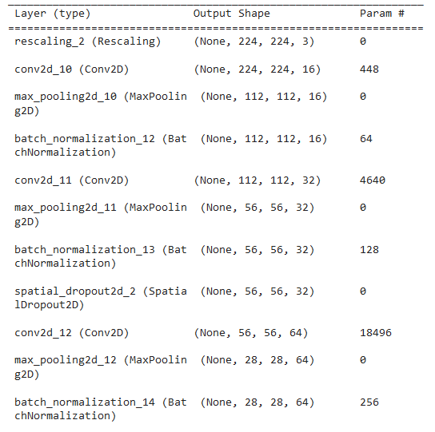
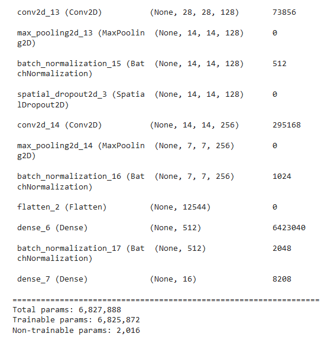

# Machine_Learning_Project

The goal of this project is to create an interactive visualization that is centered around a machine learning model used to help identify birds in the city of Houston.

# Planning the Project 

In order to start this project, we identified high level items that needed to be determined: 

1. Create and Clean a dataset 
2. Develop Train and Test Sets and Begin the Model 
3. Modify the parameters of the model to increase accuracy 
4. Create a website to display information about our model 
5. Embed a Flask app to add interactive features to the website allowing for independent uploads of photos 

# DataSet 

To obtain a dataset, we used the Flickr API. This allowed us to predetermine a list of birds we wanted to model and also predetermine a size for all photos. 

As with any dataset, the data had to be cleaned to ensure that we would get reasonable results. Some of the parameters we considered included: 
- The amount of noise in the photo (How much space the bird took up)
- Whether the photo was of the bird itself 
- The number of birds in the photo
- Large distracting features in the photo 

Once the data was cleaned, we moved onto the data modeling 

# Model 

We are using a sequential model with 10 layers overall. Our first layer is a Rescaling layer, which standardizes our RGB channel values to be between 0 and 1 (instead of shooting off to 255). Next, we have three marriages of Conv2D and MaxPooling2D layers. The Conv2D layers will be checking for patterns in the image by searching for features (such as edges in the early parts of the model, and wings and beaks in the later parts) using filters. Our padding for the Conv2D layers is "same," - padding adds extra pixels on the circumference of the image to combat filters' reduction of the original dimensions, so having padding = "same" means that the padding will result in the output being the same size as the input. The MaxPooling2D layers will aggregate the volumes input into them, which reduces the dimensions. After that we have a Flatten layer, which transmogrifies our 2D input into the 1D, and a Dense layer. Lastly, we have the output Dense layer which differs from our Conv2D and other Dense layers by not having a ReLU activation. Instead, it has a Softmax activation, which displays our results as the probabilities the examined image has of being each type of bird. At the moment, we're sitting pretty with close to 6.5 million params. In compiling our model, we chose the optimizer Adam and the loss to be categorical cross-entropy.

# Website & Flask 
Houstonians will be able to use our interactive website to upload pictures of birds they have taken around the City of Houston. Our machine will be able to identify the bird they have uploaded to our website, by returning them with the bird’s name along with a short bio about the bird. 

We will be using HTML, JavaScript, VSC and Flask on building our interactive website. 

